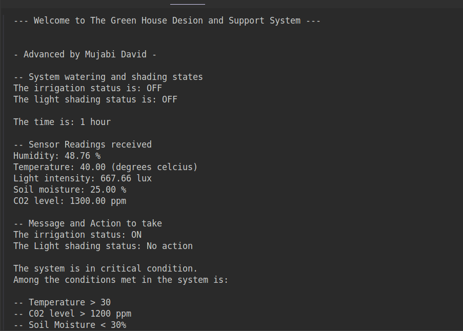
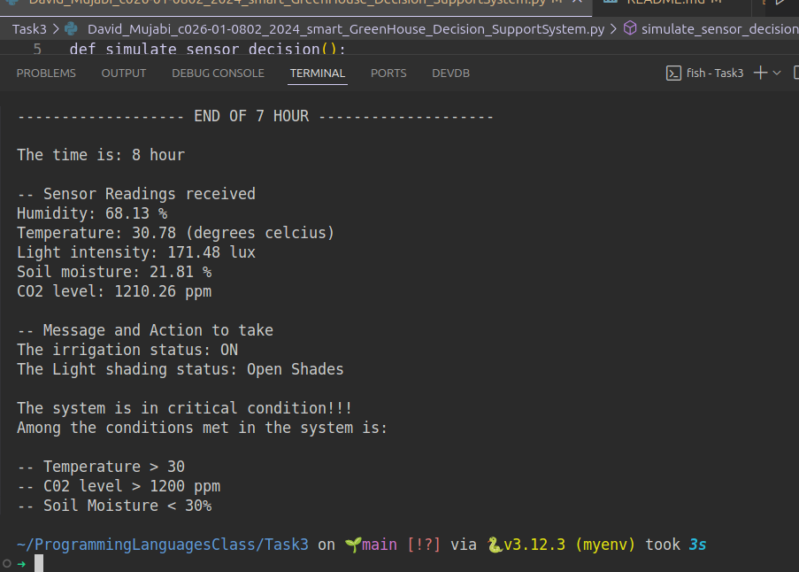
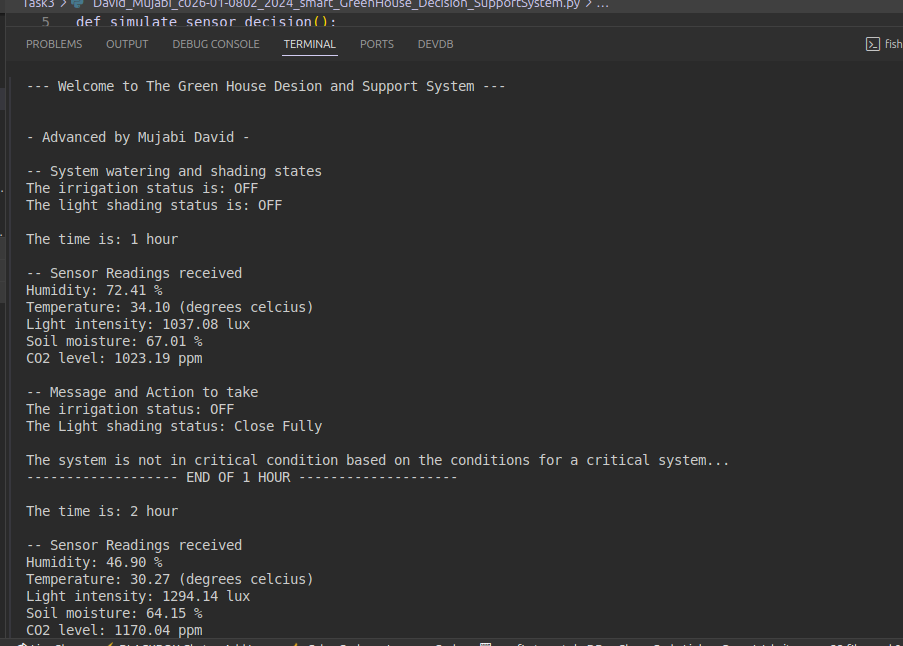

# Smart_Green_House_Decision_Support_system
Program Description.->This program is intented to help the green house farmers adapt to a system using AI to help them realise the different condtions and the actions to take for safety measures and wellbeing of agriculture. The system uses real time and it is first. The system also displays the alert messages to the farmer based on the conditions of the green house.

***Example of screenshot showing if the system is working***
-- This works with the set condions evaluating to true that is if i use set values 

***critical condition at the 8th hour ***

***Fully advanced system with messages and alerts ***

***How to find the program**
git clone https://github.com/MujabiMaarifa/ProgrammingLanguagesClass/Task3

cd Task3
***How to run the program***
python3 David_Mujabi_c026-01-0802_2024_smart_GreenHouse_Decision_SupportSystempypy

